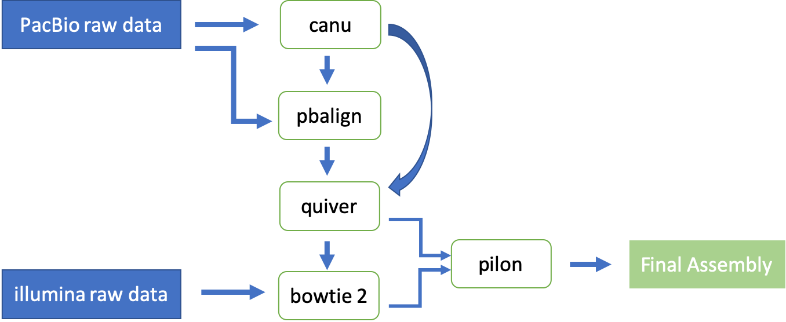

# 1. introduction
## Directory tree
[Full directory tree with the rawdata file](directory_tree.txt)
```
.
|-- canu_job
|   |-- 10_mummer
|   |   |-- consensus_pilon_HGAP_assembly.delta
|   |   |-- consensus_pilon_HGAP_assembly.filter
|   |   |-- consensus_pilon_HGAP_assembly.fplot
|   |   |-- consensus_pilon_HGAP_assembly.gp
|   |   |-- consensus_pilon_HGAP_assembly.png
|   |   |-- consensus_pilon_HGAP_assembly.rplot
|   |   |-- consensus_pilon_illumina_MPG_2013.delta
|   |   |-- consensus_pilon_illumina_MPG_2013.filter
|   |   |-- consensus_pilon_illumina_MPG_2013.fplot
|   |   |-- consensus_pilon_illumina_MPG_2013.gp
|   |   |-- consensus_pilon_illumina_MPG_2013.png
|   |   |-- consensus_pilon_illumina_MPG_2013.rplot
|   |   `-- mummer_plot.sh
|   |-- 11_cdp
|   |   |-- cdf_graph.py
|   |   |-- CDF.png
|   |   `-- cdf.sh
|   |-- 12_augustus
|   |   |-- augustus_consensus_pilon.fasta
|   |   |-- augustus_consensus_pilon.gff3
|   |   |-- augustus.sh
|   |   |-- augustus_stat_report.txt
|   |   |-- bedtools.sh
|   |   |-- consensus_pilon.fasta -> ../7_pilon/consensus_pilon.fasta
|   |   |-- consensus_pilon.fasta.fai
|   |   `-- trinityNx.sh
|   |-- 2_unzip_pacbio
|   |   |-- 0001
|   |   |-- 0002
|   |   |-- 0007
|   |   |-- 0011
|   |   |-- 0012
|   |   |-- 0013
|   |   |-- 0014
|   |   |-- 0018
|   |   |-- 0019
|   |   |-- 0020
|   |   `-- 0021
|   |-- 4_merged_fastq
|   |   `-- yeast.fastq
|   |-- 5_canu
|   |   |-- 5_canu.contigs.fasta
|   |   |-- 5_canu.contigs.gfa
|   |   |-- 5_canu.contigs.layout
|   |   |-- 5_canu.contigs.layout.readToTig
|   |   |-- 5_canu.contigs.layout.tigInfo
|   |   |-- 5_canu.correctedReads.fasta.gz
|   |   |-- 5_canu.report
|   |   |-- 5_canu.seqStore.err
|   |   |-- 5_canu.seqStore.ssi
|   |   |-- 5_canu.trimmedReads.fasta.gz
|   |   |-- 5_canu.unassembled.fasta
|   |   |-- 5_canu.unitigs.bed
|   |   |-- 5_canu.unitigs.fasta
|   |   |-- 5_canu.unitigs.gfa
|   |   |-- 5_canu.unitigs.layout
|   |   |-- 5_canu.unitigs.layout.readToTig
|   |   |-- 5_canu.unitigs.layout.tigInfo
|   |   |-- canu-logs
|   |   |-- canu-scripts
|   |   |-- haplotype
|   |   `-- tree
|   |-- 6_quiver
|   |   |-- 2_unzip_pacbio -> ../2_unzip_pacbio
|   |   |-- 5_canu.contigs.fasta -> ../5_canu/5_canu.contigs.fasta
|   |   |-- 5_canu.contigs.fasta.fai
|   |   |-- consensus.fasta
|   |   |-- consensus.fastq
|   |   |-- input_0001.fofn
|   |   |-- input_0002.fofn
|   |   |-- input_0007.fofn
|   |   |-- input_0011.fofn
|   |   |-- input_0012.fofn
|   |   |-- input_0013.fofn
|   |   |-- input_0014.fofn
|   |   |-- input_0018.fofn
|   |   |-- input_0019.fofn
|   |   |-- input_0020.fofn
|   |   |-- input_0021.fofn
|   |   |-- input_master.fofn
|   |   |-- merge_cmp_h5.sh
|   |   |-- myjoblist.txt
|   |   |-- out_0001.cmp.h5
|   |   |-- out_0002.cmp.h5
|   |   |-- out_0007.cmp.h5
|   |   |-- out_0011.cmp.h5
|   |   |-- out_0012.cmp.h5
|   |   |-- out_0013.cmp.h5
|   |   |-- out_0014.cmp.h5
|   |   |-- out_0018.cmp.h5
|   |   |-- out_0019.cmp.h5
|   |   |-- out_0020.cmp.h5
|   |   |-- out_0021.cmp.h5
|   |   |-- out_all.cmp.h5
|   |   |-- pbalign.sh
|   |   |-- prep_cmp_h5.sh
|   |   |-- quiver_run.sh
|   |   `-- variants.gff
|   |-- 7_pilon
|   |   |-- bowtie2.sh
|   |   |-- bowtie_build.sh
|   |   |-- consensus.1.bt2
|   |   |-- consensus.2.bt2
|   |   |-- consensus.3.bt2
|   |   |-- consensus.4.bt2
|   |   |-- consensus.fasta -> ../6_quiver/consensus.fasta
|   |   |-- consensus.fasta.fai
|   |   |-- consensus_pilonBadCoverage.wig
|   |   |-- consensus_pilonChanges.wig
|   |   |-- consensus_pilonClippedAlignments.wig
|   |   |-- consensus_pilonCopyNumber.wig
|   |   |-- consensus_pilonCoverage.wig
|   |   |-- consensus_pilonDeltaCoverage.wig
|   |   |-- consensus_pilonDipCoverage.wig
|   |   |-- consensus_pilon.fasta
|   |   |-- consensus_pilonGC.wig
|   |   |-- consensus_pilonPctBad.wig
|   |   |-- consensus_pilonPhysicalCoverage.wig
|   |   |-- consensus_pilonPilon.bed
|   |   |-- consensus_pilonUnconfirmed.wig
|   |   |-- consensus_pilon.vcf
|   |   |-- consensus_pilonWeightedMq.wig
|   |   |-- consensus_pilonWeightedQual.wig
|   |   |-- consensus.rev.1.bt2
|   |   |-- consensus.rev.2.bt2
|   |   |-- pilon_run.sh
|   |   |-- samtools.sh
|   |   |-- SRR1569900_1.fastq -> ../../rawdata/illumina/SRR1569900_1.fastq
|   |   |-- SRR1569900_2.fastq -> ../../rawdata/illumina/SRR1569900_2.fastq
|   |   |-- W303_consensus.bam
|   |   |-- W303_consensus.sam
|   |   |-- W303_consensus_sorted.bai
|   |   `-- W303_consensus_sorted.bam
|   |-- 8_quast
|   |   |-- quast_result
|   |   |   |-- basic_stats
|   |   |   |   |-- consensus_pilon_GC_content_plot.pdf
|   |   |   |   |-- cumulative_plot.pdf
|   |   |   |   |-- GC_content_plot.pdf
|   |   |   |   |-- HGAP_assembly_GC_content_plot.pdf
|   |   |   |   |-- illumina_MPG_2013_contig_GC_content_plot.pdf
|   |   |   |   `-- Nx_plot.pdf
|   |   |   |-- icarus.html
|   |   |   |-- icarus_viewers
|   |   |   |   `-- contig_size_viewer.html
|   |   |   |-- quast.log
|   |   |   |-- report.html
|   |   |   |-- report.pdf
|   |   |   |-- report.tex
|   |   |   |-- report.tsv
|   |   |   |-- report.txt
|   |   |   |-- transposed_report.tex
|   |   |   |-- transposed_report.tsv
|   |   |   `-- transposed_report.txt
|   |   `-- quast.sh
|   `-- 9_busco
|       |-- busco.sh
|       |-- run_9_busco_Final_Assembly
|       |   |-- angustus_output
|       |   |-- blask_output
|       |   |-- full_table_9_busco_Final_Assembly.tsv
|       |   |-- hmmer_output
|       |   |-- missing_busco_list_9_busco_Final_Assembly.tsv
|       |   |-- short_summary_9_busco_Final_Assembly.txt
|       |   `-- single_copy_busco_sequences
|       `-- tmp
|-- canu_run.sh
|-- create_folder.sh
|-- directory_tree.txt
|-- download_data.sh
|-- generate_fastq.sh
`-- rawdata
    |-- busco
    |   |-- saccharomycetales_odb9
    |   |   |-- ancestral
    |   |   |-- ancestral_variants
    |   |   |-- dataset.cfg
    |   |   |-- hmms
    |   |   |-- info
    |   |   |-- lengths_cutoff
    |   |   |-- prfl
    |   |   `-- scores_cutoff
    |   `-- saccharomycetales_odb9.tar.gz
    |-- illumina
    |   |-- SRR1569900_1.fastq
    |   `-- SRR1569900_2.fastq
    `-- REF
        |-- HGAP_assembly.fasta
        |-- illumina_MPG_2013_contig.fasta
        |-- illumina_MPG_2013.fasta
        |-- separate_short_read_contigs.py
        `-- separate_short_read_contigs.sh
```

# 2. Pipeline



# 3. Pipeline Steps
bash5tool
```
bash5tools.py --outFilePrefix ${current_file_dir}/${name_prefix} --readType subreads --minLength 1000 --outType fastq --minReadScore 0.75 ${current_file_dir}/${name_prefix}.bas.h5
```
combine each fastq file
```
cat ${INPUT_DIR}/00*/Analysis_Results/*p0.fastq > ${OUTPUT_DIR}/yeast.fastq
```


canu
```
canu -p 5_canu -d ${OUTPUT_DIR} genomeSize=${GENOME_SIZE} -pacbio-raw ${INPUT_DIR}/${OUTPUT_NAME} useGrid=false
```

### ***Quiver***
***1st: Generate .fofn file used in Pbalign***
```
ls ${INPUT_FILE_LOC}/*/*/*.bas.h5 > input_master.fofn
```
Generate .txt file for Pbalign
```
while IFS= read line
do
        SUB_NAME=$(echo $line | cut -d '/' -f2)
        echo ${line} >> input_${SUB_NAME}.fofn
        echo ${SUB_NAME} >> temp_myjoblist.txt

done <"$file"

awk '!seen[$0]++' temp_myjoblist.txt > myjoblist.txt
```
***2nd: Generate cmp.h5 file for each .bas file using Pbalign***
```
pbalign --forQuiver input_${SEED}.fofn ${REF_FASTA} out_${SEED}.cmp.h5
```
***3rd: Merge and sort .cmp.h5 file for each bas to a single file***
```
cmph5tools.py merge --outFile out_all.cmp.h5 $(ls out_*.cmp.h5)

cmph5tools.py sort --deep out_all.cmp.h5

h5repack -f GZIP=1 out_all.cmp.h5 tmp.cmp.h5 && mv tmp.cmp.h5 out_all.cmp.h5
```
***4th:Perform Quiver polishing***
```
samtools faidx ${REFERENCE}
quiver ${QUERY} -r ${REFERENCE} -o variants.gff -o consensus.fasta -o consensus.fastq
```
### ***Pilon***
***1st: Generate .fofn file used in Pbalign***


# 4. Conclusion:
### [Final Write Up](https://docs.google.com/document/d/1BDGt6vxnI0uYwd2VWN8QQTd4IVIASFijE2-ZktaumLQ/edit?usp=sharing)
