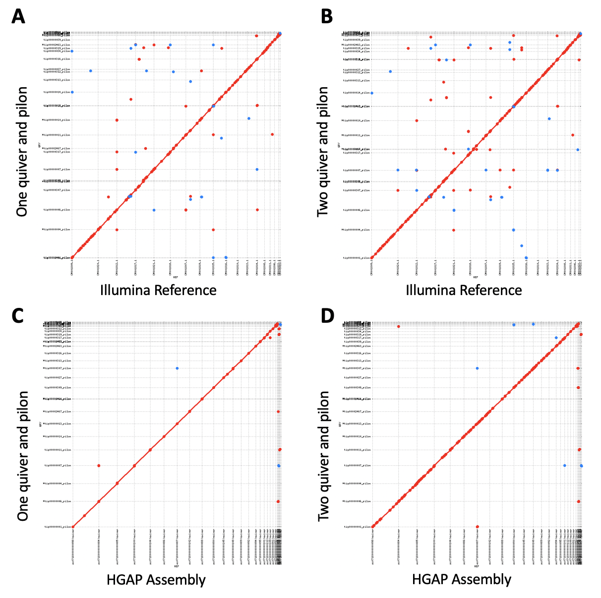
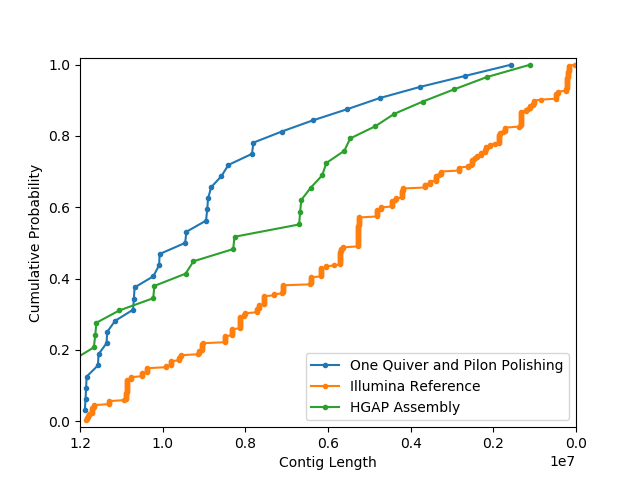

# I. Introduction

Yeast (_Saccharomyces cerevisiae_) shares many similar genes and DNA structures with human cells. For this similarity, yeast was recognized as an exerllent simplified model to study cellular activities in human cells. By understanding more about the gene and protein of yeast, researchers can shed light to mistry that center around their counter part in human cells.

In this study, we used publicly avalible _Saccharomyces cerevisiae_ W303 pacbio long read data to create a complete genome assembly. Canu was used to generate the initial assembly. After the initial assembly, Quiver was run to correct the general structure. The Quiver polished assembly was then fed into Pilon for one round of nuleotide correction to obtain the final assembly. The final assembly was evaluated by obtaining busco score with Busco, N50 and contigs count with quast against reference genome, and the continuaty with cumulative distribution function(CDF). Mummer plot is also used to compare how similar the final assembly compares to reference genome. Finally, Augustus was run to annotate the gene of the assembly and TrinityNx was used to to evaluate different statitic of the gene.

# II. Pipeline
The entire pipeline as well as the final assembly is avalible in this github repository.


The graph above displays the entire genome assembly pipeline except the analysis. The blue arrows indicates how each steps progress, the blue boxes contains the raw data, the white boxes contains the different important software in different step, and the green box is the final assembly. All statistical analysis like busco, quast, mummer plot, and CDF are performed on the final assembly. Complete demonstration of the result and the discussion is avalable in the [Final Paper](https://docs.google.com/document/d/1BDGt6vxnI0uYwd2VWN8QQTd4IVIASFijE2-ZktaumLQ/edit?usp=sharing)

# III. Pipeline Steps

Shorter explenation regarding how to run each scripts with no change to the script is avalible in each folder as README file.

The directory and file name in all bash files are important. Changes to those variable will change the directory structure of the scripts. If changes is needed, please proceed with caution.

## ***1. Environment Creation***

All of the scripts are written to be run in Anaconda environment. Please follow the [***instruction of Anaconda installation***](https://docs.conda.io/projects/conda/en/latest/user-guide/install/linux.html) to install Anaconda on ythe environment. After the installation, follow [***this instruction***](https://docs.conda.io/projects/conda/en/latest/user-guide/tasks/manage-environments.html) to import the [final_project_1.yml](final_project_1.yml), [final_project_2.yml](final_project_2.yml), and [final_project_3.yml](final_project_3.yml).

The final_project_1 environment contains packages for the genome assembly process, Busco statistical analysis, and Quast statistical analysis.

The final_project_2 environment contains packages for the mummer plot generation.

The final_project_3 environment contains packages for Augustus gene annotation and Trinity statistical analysis.

***Smrtanalysis v2.3.0p5 is required along side these three environment as the Pbalign module in Smrtanalysis is needed during the preperation step of Quiver polishing***


## ***2. Data Preperation***

The goal for this step is to create the directories needed for the pipeline and download the required rawdata as well as reference data.

### **2.1. Directory Tree Genearation**

The script [create_folder.sh](Create_Environment/create_folder.sh) generate all of the folders required for this pipeline in the directory the script is run besides the canu_job/5_Canu/ directory.

Please run this script in a clean directory to avoid any interference. The directory the create_folder.sh is run on will be called as ***master directory*** from now on.

### **2.2. Data Download**

[download_data.sh](Create_Environment/download_data.sh) (run in the master folder that contains canu_job/ and rawdata/ folder)

Both raw data and both reference data are downloaded into its required directory.

## ***3. Canu Genome Assembling***

The goal for this step it to takes the ```Pacbio rawdata``` as input and generate the initial assembly using Canu in the form of a ```5_canu.contigs.fasta``` file

### **3.1. Base Calling**

[generate_fastq.sh](Canu/generate_fastq.sh) (run in the master folder that contains canu_job/ and rawdata/ folder)

Base calling process for ```each of the 11 the Pacbio long read rawdata``` are performed using bash5tools and output into a ```single fastq``` file using cat command. 

```
bash5tools.py --outFilePrefix ${current_file_dir}/${name_prefix} --readType subreads --minLength 1000 --outType fastq --minReadScore 0.75 ${current_file_dir}/${name_prefix}.bas.h5
```
```
cat ${INPUT_DIR}/00*/Analysis_Results/*p0.fastq > ${OUTPUT_DIR}/yeast.fastq
```

### **3.2. Genome Assembling**

[canu_run.sh](Canu/canu_run.sh) (run in the master folder that contains canu_job/ and rawdata/ folder)

Canu is used to generate the initial assembly using the ```fastq file from the previous base calling step``` as input. The genomeSize variable of this step is set to be 12Mbp. The main output from this step is ```5_canu.contigs.fasta```.

```
canu -p 5_canu -d ${OUTPUT_DIR} genomeSize=${GENOME_SIZE} -pacbio-raw ${INPUT_DIR}/${OUTPUT_NAME} useGrid=false
```

## ***4. Quiver Long Read Polishing***

The goal for this step is to take the ```5_canu.contigs.fasta``` initial assembly and perform structural correction using the same ```Pacbio rawdata``` to generate a polished assembly in the form of a ```consensus.fasta``` for one round polishing or ```consensus_second.fasta``` for two round polishing.

### **4.1. Generate file used for Pbalign**

[prep_cmp_h5.sh](Polish/Quiver/prep_cmp_h5.sh) (run inside folder canu_job/6_quiver/)

This script generate a ```.fofn``` file and a ```.txt``` file that is used in the pbalign step. Both file serve as the reference of the location of the .bas file and the list for the .bas file used in the pbalign mapping.

Generation of .fofn file.
```
ls ${INPUT_FILE_LOC}/*/*/*.bas.h5 > input_master.fofn
```
Generation of  .txt file.
```
while IFS= read line
do
        SUB_NAME=$(echo $line | cut -d '/' -f2)
        echo ${line} >> input_${SUB_NAME}.fofn
        echo ${SUB_NAME} >> temp_myjoblist.txt

done <"$file"

awk '!seen[$0]++' temp_myjoblist.txt > myjoblist.txt
```

### **4.2. Using Pbalign to map Pacbio long read data**

[pbalign.sh](Polish/Quiver/pbalign.sh) (run inside folder canu_job/6_quiver/)

This script takes in the ```.txt``` and ```.fofn``` list file generated in step 4.1 and map each of the 11 Pacbio rawdata into the ```.cmp.h5 long read references``` needed for the Quiver polishing using pbalign.

```
pbalign --forQuiver input_${SEED}.fofn ${REF_FASTA} out_${SEED}.cmp.h5
```
### **4.3. Merge and sort mapped reference file for each bas to a single reference file**

[merge_cmp_h5.sh](Polish/Quiver/merge_cmp_h5.sh) (run inside folder canu_job/6_quiver/)

In this step, the 11 individual mapped data from step 4.2 are merged into a single .cmp.h5 data with the script using cmph5tools.
```
cmph5tools.py merge --outFile out_all.cmp.h5 $(ls out_*.cmp.h5)
```
The merged data is then sorted and filtered with the following script using cmph5tools and h5repack.
```
cmph5tools.py sort --deep out_all.cmp.h5

h5repack -f GZIP=1 out_all.cmp.h5 tmp.cmp.h5 && mv tmp.cmp.h5 out_all.cmp.h5
```
### **4.4. Quiver polishing**

[quiver_run.sh](Polish/Quiver/quiver_run.sh) (run inside folder canu_job/6_quiver/)

Quiver polishing is performed in this step with two input, the mapped and processed data from step 4.1-4.3 and the the initial assembly ```5_canu.contigs.fasta``` from step 3.2. The initial assembly is first indexed before Quiver with script

```
samtools faidx ${REFERENCE}
```
The polishing is then performed with the script 
```
quiver ${QUERY} -r ${REFERENCE} -o variants.gff -o consensus.fasta -o consensus.fastq
```
The output from this polishing that will be used in next steps is ```consensus.fasta```.

The following code should be used if second round of Quiver polishing is needed. It will index the polished assembly from the first Quiver polishing and use it in place of the initial assembly to perform the second round of Quiver polishing. The output is ```consensus_second.fasta```

```
samtools faidx ${SECOND_REF}
quiver ${QUERY} -r ${SECOND_REF} -o variants_second.gff -o consensus_second.fasta -o consensus_second.fastq
```

## ***5. Pilon Short Read Polishing***
The goal for this step is to take the ```consensus.fasta``` Quiver polished assembly and use Pilon to perform one round of base pair correction with the ```Illumina rawdata```. This step will output a polished assembly in the form of a ```consensus_pilon.fasta```.

In the case of two rounds of Quiver polishing was performed in previous step, one can change the ```consensus_second.fasta``` from the second round of Quiver polishing into the ```consensus.fasta``` and proceed the step as normal to obtain pilon polished file named ```consensus_pilon.fasta```. One can also use the ```consensus_second.fasta``` file as input and change the ```REF_Prefix``` variable in all fthe pilon steps files from ```consensus``` into ```consensus_second``` to obtain pilon polished file named ```consensus_second_pilon.fasta```.

### **5.1. Indexing the Illumina data for Bowtie2**

[bowtie_build.sh](Polish/Pilon/bowtie_build.sh) (run inside folder canu_job/7_pilon/)

In this step, bowtie2-build is used to take the illumina short read data and index the illumina rawdata into a set of six files with the suffixes of ```.1.bt2, .2.bt2, .3.bt2, .4.bt2, .rev.1.bt2, and .rev.2.bt2```.

```
bowtie2-build --threads ${NSLOTS} ${REF_DIR}/${REF} $(basename ${REF} .fasta)
```

### **5.2. Allign the indexed Illumina data**

[bowtie2.sh](Polish/Pilon/bowtie2.sh) (run inside folder canu_job/7_pilon/)

In this step, bowtie2 is used to alligned the illumina short read data. It takes in the set of six files from the previous step 5.1 as well as the two illumina fastq data file and output the set of allignment in .sam format.

```
bowtie2 --threads ${NSLOTS} -x ${REF_Prefix} -1 ${SAMPLE_1} -2 ${SAMPLE_2} -S ${ILLUMINA_SAMPLE_NAME}_${REF_Prefix}.sam
```
### **5.3. Sorting and indexing the alligned Illumina data**

[samtools.sh](Polish/Pilon/samtools.sh) (run inside folder canu_job/7_pilon/)

In this step, various module of samtools is used to sort and index the alligned illumina data that will be used as reference for Pilon polishing. The script for these steps are the following
```
samtools view --threads ${NSLOTS} -b ${ILLUMINA_ALLIGNED} --reference ${REF} -o $(basename ${ILLUMINA_ALLIGNED} .sam).bam
samtools sort --threads ${NSLOTS} $(basename ${ILLUMINA_ALLIGNED} .sam).bam -o $(basename ${ILLUMINA_ALLIGNED} .sam)_sorted.bam
samtools index -b $(basename ${ILLUMINA_ALLIGNED} .sam)_sorted.bam $(basename ${ILLUMINA_ALLIGNED} .sam)_sorted.bai
```
### **5.4. Pilon polishing**

[pilon_run.sh](Polish/Pilon/pilon_run.sh) (run inside folder canu_job/7_pilon/)

In this step, Pilon is used to perform base pair correction to the Quiver polished assembly from step 4. The alligned, sorted, and indexed illumina data as well as the polished assembly data from step 4 ```consensus.fasta``` are the input. Pilon outputs a polished assembly named ```consensus_pilon.fasta```.

```
pilon --vcf --tracks --threads ${NSLOTS} --genome ${REF} --frags ${ILLUMINA_ALLIGNED} --output $(basename ${REF} .fasta)_pilon
```

## ***6. Data Analysis***
The goal for this step is to perform statistical analysis on the final W303 genome assembly obtained from step 3-5 to check the quality of the quality.

### **6.0.1. Generate contig short read reference**

[separate_short_read_contigs.sh](Analysis/separate_short_read_contigs.sh) (run inside folder rawdata/REF/ while [separate_short_read_contigs.py](Analysis/separate_short_read_contigs.py) is in the same folder )

[separate_short_read_contigs.py](Analysis/separate_short_read_contigs.py)

Because the short read reference used durin analysis is in the form of scaffold. This step serve to break the scaffold reference ```illumina_MPG_2013.fasta``` into contig reference for analysis like quast. The bash file runs the python script which will breakdown the scaffold in the name of ```illumina_MPG_2013_contig.fasta```. 


### **6.1. Basic statistical Analysis with Quast**

[quast.sh](Analysis/Quast/quast.sh) (run inside folder canu_job/8_quast)

This script takes in genome assemblies to produce basic statistical analysis values like N50 and contigs count. The output from Quast will be in a folder named ```quast_result``` The default assembly input for this script contains the final assembly with one round of Quiver polishing and one round of Pilon polishing, the long read reference, and the short read reference

The contig version of short read reference is used in this analysis. 

```
quast ../7_pilon/consensus_pilon.fasta ../../rawdata/REF/HGAP_assembly.fasta ../../rawdata/REF/illumina_MPG_2013_contig.fasta -o quast_result
```
The output of the specific run is shown in the following figure except the Busco Score. More explenation in the [Final Paper](https://docs.google.com/document/d/1BDGt6vxnI0uYwd2VWN8QQTd4IVIASFijE2-ZktaumLQ/edit?usp=sharing).


### **6.2. Busco analysis**

[busco.sh](Analysis/Busco/busco.sh) (run inside folder canu_job/9_busco/) (activate different part of the script to obtain busco result for differernt assembly)

Busco evaluates how much similarity shares between the provided assembly and the busco reference species. In the case, we compare the assembly against the _Saccharomyces cerevisiae_ S288C reference dataset from busco.

***When runnning ```busco.sh``` for the first time, go in to ```busco.sh```, uncomment both export command and run the code with those export command. After the first run, comment out both export command like the original code and run it without the export command.***

The scaffold version of short read reference is used in this analysis. 

```
run_busco -c ${NSLOTS} -i ${INPUT_FASTA} -l ../../rawdata/busco/saccharomycetales_odb9 -o 9_busco_${INPUT_DATA_TYPE} -m geno -sp saccharomyces_cerevisiae_S288C
```

The Busco Score row shows the output of the run. More explenation in the [Final Paper](https://docs.google.com/document/d/1BDGt6vxnI0uYwd2VWN8QQTd4IVIASFijE2-ZktaumLQ/edit?usp=sharing).


### **6.3. Alignment plots**

[mummer_plot.sh](Analysis/Mummer_plot/mummer_plot.sh) (run inside folder canu_job/10_mummer/)

Alignment plots are generated to compare the difference between the assembly and the reference as well as between the assembly with different rounds of Quiver polishing. 

The contig version of short read reference is used in this analysis. 

The two assembly is first alligned with nucmer against each other to produce a ```.delta file``` with the following code.
```
nucmer -p ${ASSEMBLY_PREFIX}_${REF_PREFIX} \
${REF_DIR}/${REF_PREFIX}.fasta \
${ASSEMBLY_DIR}/${ASSEMBLY_PREFIX}.fasta
```
The ```.delta file``` is then feeded into mummerplot alongside ```both assembly file``` with the following code to generate ```alignment plot in .png format```.
```
mummerplot --fat --layout --filter \
-p ${ASSEMBLY_PREFIX}_${REF_PREFIX} ${ASSEMBLY_PREFIX}_${REF_PREFIX}.delta \
-R ${REF_DIR}/${REF_PREFIX}.fasta \
-Q ${ASSEMBLY_DIR}/${ASSEMBLY_PREFIX}.fasta \
--png
```

Following plot are generated from the run. Specific explenation and legend is avalible in the [Final Paper](https://docs.google.com/document/d/1BDGt6vxnI0uYwd2VWN8QQTd4IVIASFijE2-ZktaumLQ/edit?usp=sharing)




### **6.4. Cumulative distribution function(CDF)**

[CDF.sh](Analysis/CDF/CDF.sh)  (run inside folder canu_job/11_CDF while [cdf_graph.py](Analysis/CDF/cdf_graph.py) is in the same folder)

[cdf_graph.py](Analysis/CDF/cdf_graph.py)

Cumulative distribution function(CDF) is generated to show the contig size distribution for the assembly. More detailed explenation in the [Final Paper](https://docs.google.com/document/d/1BDGt6vxnI0uYwd2VWN8QQTd4IVIASFijE2-ZktaumLQ/edit?usp=sharing)

The contig version of short read reference is used in this analysis. 



### **6.5. Augustus gene annotation and TrinityNx mRNA statistical Analysis**
Augustus and TrinityNx produced the annotation to the assembly and the statistical Analysis for the annotated mRNA fragment.

**6.5.1** 

[augustus.sh](Analysis/Augustus/augustus.sh) (run inside folder canu_job/12_augustus  ***Edit in your LD_LIBRARY_PATH accordingly***)

The augustus annotate the final assembly as _Saccharomyces cerevisiae_ S288C and output the annotation in .gff3 file.

```
augustus --species=saccharomyces_cerevisiae_S288C consensus_pilon.fasta --gff3=on --outfile=augustus_consensus_pilon.gff3  --stopCodonExcludedFromCDS=false
```

**6.5.2** 

[bedtools.sh](Analysis/Augustus/bedtools.sh)  (run inside folder canu_job/12_augustus)

Bedtools extract the mRNA fragment from the augustus annotation into a fasta file.

```
bedtools getfasta -fi consensus_pilon.fasta -fo augustus_consensus_pilon.fasta -bed augustus_consensus_pilon.gff3
```

**6.5.3** 

[trinityNx.sh](Analysis/Augustus/trinityNx.sh) (run inside folder canu_job/12_augustus)

TrinityNx act similar to quast to provide basic statistical analysis for the mRNA extracted from the Augustus annotation.

```
TrinityStats.pl  augustus_consensus_pilon.fasta > augustus_stat_report.txt
```

The output of TrinityNx in the experiment is the following. More detailed explenation in the [Final Paper](https://docs.google.com/document/d/1BDGt6vxnI0uYwd2VWN8QQTd4IVIASFijE2-ZktaumLQ/edit?usp=sharing)


# IV. Conclusion:
### Please check the [Final Paper](https://docs.google.com/document/d/1BDGt6vxnI0uYwd2VWN8QQTd4IVIASFijE2-ZktaumLQ/edit?usp=sharing)


# V. Directory Tree

[Full directory tree with the rawdata file](directory_tree.txt)
```
.
|-- canu_job
|   |-- 10_mummer
|   |   |-- consensus_pilon_HGAP_assembly.delta
|   |   |-- consensus_pilon_HGAP_assembly.filter
|   |   |-- consensus_pilon_HGAP_assembly.fplot
|   |   |-- consensus_pilon_HGAP_assembly.gp
|   |   |-- consensus_pilon_HGAP_assembly.png
|   |   |-- consensus_pilon_HGAP_assembly.rplot
|   |   |-- consensus_pilon_illumina_MPG_2013.delta
|   |   |-- consensus_pilon_illumina_MPG_2013.filter
|   |   |-- consensus_pilon_illumina_MPG_2013.fplot
|   |   |-- consensus_pilon_illumina_MPG_2013.gp
|   |   |-- consensus_pilon_illumina_MPG_2013.png
|   |   |-- consensus_pilon_illumina_MPG_2013.rplot
|   |   `-- mummer_plot.sh
|   |-- 11_cdp
|   |   |-- cdf_graph.py
|   |   |-- CDF.png
|   |   `-- cdf.sh
|   |-- 12_augustus
|   |   |-- augustus_consensus_pilon.fasta
|   |   |-- augustus_consensus_pilon.gff3
|   |   |-- augustus.sh
|   |   |-- augustus_stat_report.txt
|   |   |-- bedtools.sh
|   |   |-- consensus_pilon.fasta -> ../7_pilon/consensus_pilon.fasta
|   |   |-- consensus_pilon.fasta.fai
|   |   `-- trinityNx.sh
|   |-- 2_unzip_pacbio
|   |   |-- 0001
|   |   |-- 0002
|   |   |-- 0007
|   |   |-- 0011
|   |   |-- 0012
|   |   |-- 0013
|   |   |-- 0014
|   |   |-- 0018
|   |   |-- 0019
|   |   |-- 0020
|   |   `-- 0021
|   |-- 4_merged_fastq
|   |   `-- yeast.fastq
|   |-- 5_canu
|   |   |-- 5_canu.contigs.fasta
|   |   |-- 5_canu.contigs.gfa
|   |   |-- 5_canu.contigs.layout
|   |   |-- 5_canu.contigs.layout.readToTig
|   |   |-- 5_canu.contigs.layout.tigInfo
|   |   |-- 5_canu.correctedReads.fasta.gz
|   |   |-- 5_canu.report
|   |   |-- 5_canu.seqStore.err
|   |   |-- 5_canu.seqStore.ssi
|   |   |-- 5_canu.trimmedReads.fasta.gz
|   |   |-- 5_canu.unassembled.fasta
|   |   |-- 5_canu.unitigs.bed
|   |   |-- 5_canu.unitigs.fasta
|   |   |-- 5_canu.unitigs.gfa
|   |   |-- 5_canu.unitigs.layout
|   |   |-- 5_canu.unitigs.layout.readToTig
|   |   |-- 5_canu.unitigs.layout.tigInfo
|   |   |-- canu-logs
|   |   |-- canu-scripts
|   |   |-- haplotype
|   |   `-- tree
|   |-- 6_quiver
|   |   |-- 2_unzip_pacbio -> ../2_unzip_pacbio
|   |   |-- 5_canu.contigs.fasta -> ../5_canu/5_canu.contigs.fasta
|   |   |-- 5_canu.contigs.fasta.fai
|   |   |-- consensus.fasta
|   |   |-- consensus.fastq
|   |   |-- input_0001.fofn
|   |   |-- input_0002.fofn
|   |   |-- input_0007.fofn
|   |   |-- input_0011.fofn
|   |   |-- input_0012.fofn
|   |   |-- input_0013.fofn
|   |   |-- input_0014.fofn
|   |   |-- input_0018.fofn
|   |   |-- input_0019.fofn
|   |   |-- input_0020.fofn
|   |   |-- input_0021.fofn
|   |   |-- input_master.fofn
|   |   |-- merge_cmp_h5.sh
|   |   |-- myjoblist.txt
|   |   |-- out_0001.cmp.h5
|   |   |-- out_0002.cmp.h5
|   |   |-- out_0007.cmp.h5
|   |   |-- out_0011.cmp.h5
|   |   |-- out_0012.cmp.h5
|   |   |-- out_0013.cmp.h5
|   |   |-- out_0014.cmp.h5
|   |   |-- out_0018.cmp.h5
|   |   |-- out_0019.cmp.h5
|   |   |-- out_0020.cmp.h5
|   |   |-- out_0021.cmp.h5
|   |   |-- out_all.cmp.h5
|   |   |-- pbalign.sh
|   |   |-- prep_cmp_h5.sh
|   |   |-- quiver_run.sh
|   |   `-- variants.gff
|   |-- 7_pilon
|   |   |-- bowtie2.sh
|   |   |-- bowtie_build.sh
|   |   |-- consensus.1.bt2
|   |   |-- consensus.2.bt2
|   |   |-- consensus.3.bt2
|   |   |-- consensus.4.bt2
|   |   |-- consensus.fasta -> ../6_quiver/consensus.fasta
|   |   |-- consensus.fasta.fai
|   |   |-- consensus_pilonBadCoverage.wig
|   |   |-- consensus_pilonChanges.wig
|   |   |-- consensus_pilonClippedAlignments.wig
|   |   |-- consensus_pilonCopyNumber.wig
|   |   |-- consensus_pilonCoverage.wig
|   |   |-- consensus_pilonDeltaCoverage.wig
|   |   |-- consensus_pilonDipCoverage.wig
|   |   |-- consensus_pilon.fasta
|   |   |-- consensus_pilonGC.wig
|   |   |-- consensus_pilonPctBad.wig
|   |   |-- consensus_pilonPhysicalCoverage.wig
|   |   |-- consensus_pilonPilon.bed
|   |   |-- consensus_pilonUnconfirmed.wig
|   |   |-- consensus_pilon.vcf
|   |   |-- consensus_pilonWeightedMq.wig
|   |   |-- consensus_pilonWeightedQual.wig
|   |   |-- consensus.rev.1.bt2
|   |   |-- consensus.rev.2.bt2
|   |   |-- pilon_run.sh
|   |   |-- samtools.sh
|   |   |-- SRR1569900_1.fastq -> ../../rawdata/illumina/SRR1569900_1.fastq
|   |   |-- SRR1569900_2.fastq -> ../../rawdata/illumina/SRR1569900_2.fastq
|   |   |-- W303_consensus.bam
|   |   |-- W303_consensus.sam
|   |   |-- W303_consensus_sorted.bai
|   |   `-- W303_consensus_sorted.bam
|   |-- 8_quast
|   |   |-- quast_result
|   |   |   |-- basic_stats
|   |   |   |   |-- consensus_pilon_GC_content_plot.pdf
|   |   |   |   |-- cumulative_plot.pdf
|   |   |   |   |-- GC_content_plot.pdf
|   |   |   |   |-- HGAP_assembly_GC_content_plot.pdf
|   |   |   |   |-- illumina_MPG_2013_contig_GC_content_plot.pdf
|   |   |   |   `-- Nx_plot.pdf
|   |   |   |-- icarus.html
|   |   |   |-- icarus_viewers
|   |   |   |   `-- contig_size_viewer.html
|   |   |   |-- quast.log
|   |   |   |-- report.html
|   |   |   |-- report.pdf
|   |   |   |-- report.tex
|   |   |   |-- report.tsv
|   |   |   |-- report.txt
|   |   |   |-- transposed_report.tex
|   |   |   |-- transposed_report.tsv
|   |   |   `-- transposed_report.txt
|   |   `-- quast.sh
|   `-- 9_busco
|       |-- busco.sh
|       |-- run_9_busco_Final_Assembly
|       |   |-- angustus_output
|       |   |-- blask_output
|       |   |-- full_table_9_busco_Final_Assembly.tsv
|       |   |-- hmmer_output
|       |   |-- missing_busco_list_9_busco_Final_Assembly.tsv
|       |   |-- short_summary_9_busco_Final_Assembly.txt
|       |   `-- single_copy_busco_sequences
|       `-- tmp
|-- canu_run.sh
|-- create_folder.sh
|-- directory_tree.txt
|-- download_data.sh
|-- generate_fastq.sh
`-- rawdata
    |-- busco
    |   |-- saccharomycetales_odb9
    |   |   |-- ancestral
    |   |   |-- ancestral_variants
    |   |   |-- dataset.cfg
    |   |   |-- hmms
    |   |   |-- info
    |   |   |-- lengths_cutoff
    |   |   |-- prfl
    |   |   `-- scores_cutoff
    |   `-- saccharomycetales_odb9.tar.gz
    |-- illumina
    |   |-- SRR1569900_1.fastq
    |   `-- SRR1569900_2.fastq
    `-- REF
        |-- HGAP_assembly.fasta
        |-- illumina_MPG_2013_contig.fasta
        |-- illumina_MPG_2013.fasta
        |-- separate_short_read_contigs.py
        `-- separate_short_read_contigs.sh
```