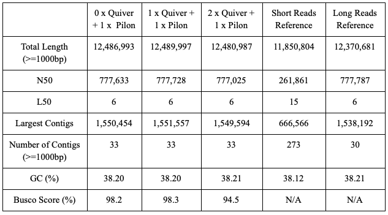
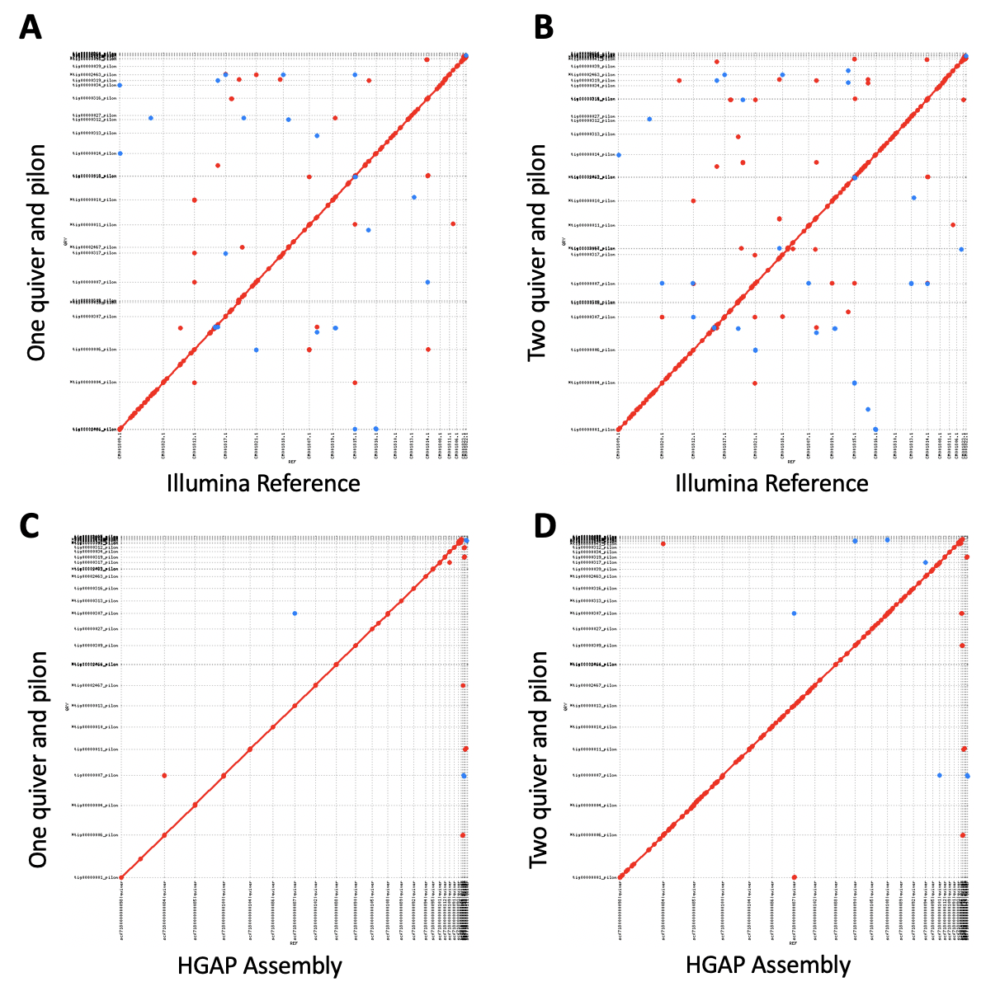
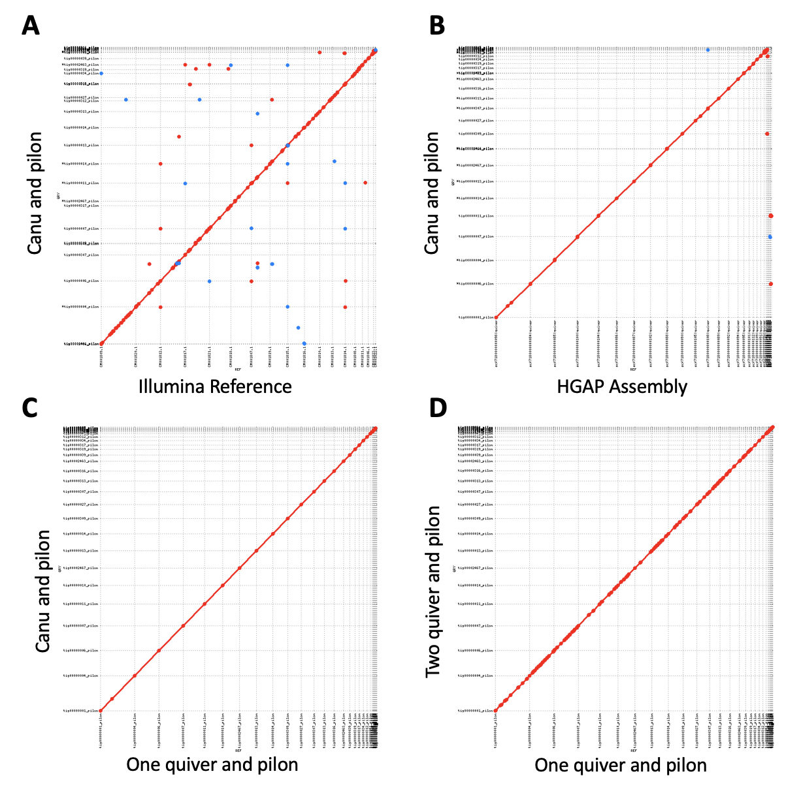
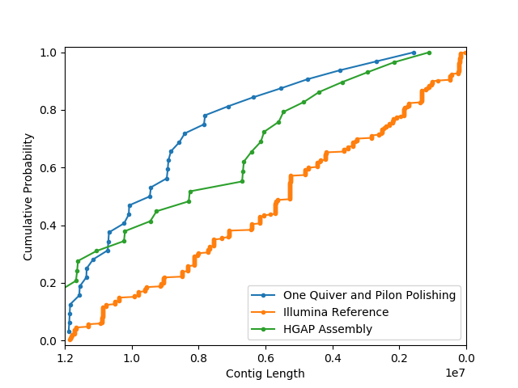

Renhao Luo's README.md

# I. Introduction

Yeast (Saccharomyces cerevisiae) has been recognized as an important model in the field of biology because some essential cellular processes are the same in human and in yeast. Scientists could use the yeast as a model to figure out the connection between gene, protein, and functions.

In this project, we used publicly available Saccharomyces cerevisiae W303 PacBio data to assemble the yeast genome by using Canu. After assembly, we used quiver to correct the structure and pilon to correct nucleotides. Busco score was used to evaluate the assembly results, while quast was applied to compare our assembly results with the reference genome. Lastly, we run Augustus and TrinityStats to report the genome annotation and its basic statstical results, respectively.


# II. Pipeline

All of the codes used in this project are available in this github repository. As long as you have created the environment and required softwares were installed properly (details in section III), you should be able to run all the programs without changing the scripts. 


The entire Assembly work flow is shown in the graph above. The blue arrow represents where the result from each step would go. After each step, a Busco score is obtained and statistical results are calculated by Quast. Lastly, graphs were constructed in the end, and Augustus and Trinity were run for gene annotation results. Each step is explained in the following sections. Information about versions are described in the [final paper](https://docs.google.com/document/d/1BDGt6vxnI0uYwd2VWN8QQTd4IVIASFijE2-ZktaumLQ/edit?usp=sharing).

# III. Pipeline Steps

The naming of each parameter in each tool used in this section are for your reference. Please check our bash files in this repository for details on how we ran the program using those parameters. We designed the code try to be as clear as possible. 

## 1. Preparation

### 1.1 File Directory Set Up

The first step is to set up the file directory on your machine. Our [create_folder.sh](Create_Environment/create_folder.sh) helps you to create directory for all the rawdata, scripts, and results.

### 1.2 Environment Set Up and Download Data

Three independent environments were used in this project, and the .yml files are linked below. 

All assembly works were completed in [final_project_1.yml](final_project_1.yml)
    
***Note: You need to have your own access to smrtanalysis v2.3.0p5 as it contains Pbalign and Quiver. The specific version of the tools are not available on Anaconda*** 

All the alignment graphs were generated in [final_project_2.yml](final_project_2.yml)

Augustus and Trinity were ran in [final_project_3.yml](final_project_3.yml)

All the data used in this project are publicly available. All the data can obtain by using ```wget```. all ```wget``` commands can be found in our [download_data.sh](Create_Environment/download_data.sh) bash file. There are total of 11 separated folders for the PacBio data. 

## 2. Canu Assembly

### 2.1 Converting raw data to a single master FASTQ

The Bash5tools is used to convert each PackBio raw data (.bas.h5) to a FASTQ file.

The following code will be run in a for loop to covert all raw data in 11 folders to FASTQ file. (Check our [bash script](Canu/generate_fastq.sh) on how to use the tool)

```bash5tools.py --outFilePrefix ${output_file_name} --readType subreads --minLength 1000 --outType fastq --minReadScore 0.75 ${PacBio_raw_data}.bas.h5```

The output file is a FASTQ file for each .bas.h5 file. The name prefix is the same as the raw data's name prefix. As you can see from our file directory that in each raw data file, there is a FASTQ file. The next step is to combine all the single FASTQ file to a master FASTQ file. 

```cat ${working_directory}/*.fastq > ${working_directory}/yeast.fastq```

The output file name is ```yeast.fastq```. The yeast.fastq will be used as the input file in Canu Run. 

### 2.2 Canu run

Once we have the ```yeast.fastq```, we can run Canu to assembly the genome. 

```canu -p 5_canu -d ${output_directory} genomeSize=12m -pacbio-raw yeast.fastq useGrid=false```

The variable "genomeSize" is given from the [Saccharomyces Genome Database](https://www.yeastgenome.org). There are many output files from Canu, and they all have 5_canu as their prefix. ```5_canu.contigs.fasta``` will be used for polishing. 

## 3. Polishing

***Note: In this section, the first PacBio raw data folder (0001) is used as an example on running the example code. All the codes need to run for all 11 PacBio raw data folders to get final results. Details on how we run the codes are in each scripts in this repository.***


### 3.1 Structural Polishing Using Long Reads

***You need to have your access to smrtanalysis v2.3.0p5 for this section, and ```module load smrtanalysis/2.3.0p5``` before you run***

### 3.1.1 Pbalign

Prior to run Pbalign, a .fofn file for each raw data needs to generate. The .fofn file is basically a list of raw data name. To generate the fofn file, use ``` ${raw_data_name_prefix} >> input_0001.fofn ```

After generating the .fofn file, we can run Pbalign. 

```pbalign --forQuiver input_0001.fofn 5_canu.contigs.fasta out_0001.cmp.h5```

The output of Pbalign is ```out_0001.cmp.h5```. All the .cmp.h5 will need to merge into a single file for Quiver polishing, using ``` out_*.cmp.h5 >> out_all.cmp.h5```

### 3.1.2 Quiver

```out_all.cmp.h5``` will need to go through merge, sort and filter before Quiver polishing using Cmph5tools and H5repack. Codes are as following.

```
cmph5tools.py merge --outFile out_all.cmp.h5 $(ls out_*.cmp.h5)

cmph5tools.py sort --deep out_all.cmp.h5

h5repack -f GZIP=1 out_all.cmp.h5 tmp.cmp.h5 && mv tmp.cmp.h5 out_all.cmp.h5
```
The final output of all the steps are still ```out_all.cmp.h5```.
Furthermore, we need to index the ```5_canu.contigs.fasta``` before running Quiver using Samtools.

```samtools faidx 5_canu.contigs.fasta```

Running Quiver:

```quiver out_all.cmp.h5 -r 5_canu.contigs.fasta -o variants.gff -o consensus.fasta -o consensus.fastq ```

The outputs of Quiver are three files, ```variants.gff``` ```consensus.fasta``` ```consensus.fastq```. 

***For the second round of Quvier, ```consensus.fasta``` will need to be index and use as reference.*** 

### 3.2 Nucleotide Polishing Using Short Reads

### 3.2.1 Align illumina data

Prior to Pilon, the illumina raw data will need to align with long read. Bowtie2 is used to do this task. 

Before Bowtie2, Botie2-build is needed to builds a Bowtie index from a DNA sequence.

```bowtie2-build --threads ${NSLOTS} consensus.fasta consensus```

Bowtie2-build has 6 output files, including ``` .1.bt2, .2.bt2, .3.bt2, .4.bt2, .rev.1.bt2 ``` and ```.rev.2.bt2. ```, and these will be used by Bowtie2

Then, we can run Bowtie2 to align the illumina data. The illumina data come with two separate FASTQ files. 

```bowtie2 --threads ${NSLOTS} -x consensus -1 ${1st_illumina_fastq_file} -2 ${2nd_illumina_fastq_file} -S W303_consensus.sam```

```--threads ${NSLOTS}``` defines how many threads that the program allow to use.

The output from Bowtie2 (aligned illumina data) is the ```W303_consensus.sam```, which will be the input in Pilon polishing. 

### 3.2.2 Pilon polishing

The ```W303_consensus.sam``` needs to be sorted and indexed before using as input for Pilon. These tasks need Samtools to complete. Codes are as following.

```
samtools view --threads ${NSLOTS} -b W303_consensus.sam --reference 5_canu.contigs.fasta` -o W303_consensus.bam
samtools sort --threads ${NSLOTS} W303_consensus.bam -o W303_consensus_sorted.bam
samtools index -b W303_consensus_sorted.bam W303_consensus_sorted.bai
```
The file that we need to use as input for Pilon is ```W303_consensus_sorted.bam```.

Then, we can run Pilon using the following code. 

```pilon --vcf --tracks --threads ${NSLOTS} --genome consensus.fasta --frags W303_consensus_sorted.bam --output consensus_pilon ```

The output file from Pilon is ```consensus_pilon.fasta```. Until here, the assembly process is completed. 

## 4. Analysis

### 4.1 Busco Score

We run the Busco Score after each step described above using following code.

Note: in order to run Busco, you need to download the Busco dataset from their [offical website](https://busco.ezlab.org). 

```run_busco -c ${NSLOTS} -i ${INPUT_FASTA} -l ../../rawdata/busco/saccharomycetales_odb9 -o 9_busco -m geno -sp saccharomyces_cerevisiae_S288C ```

In the code above, ```${INPUT_FASTA}``` is where you provide the FASTA file for evaluation. -l is the link to the downloaded Busco dataset. -m is the type of input, and -sp specifies the species. 

The output of Busco is a folder. In the case above, the folder is named as ```9_busco```. Inside the output folder, there will be a ```short_summary_9_busco.txt```, where your Busco score states inside. In the folder, there are different other files containing logs generated during the process.  

### 4.2 Quast

Quast is used to obtain the basic statistical results after each step. 

The code is as following.

```
quast ../7_pilon/consensus_pilon.fasta ../../rawdata/REF/HGAP_assembly.fasta ../../rawdata/REF/illumina_MPG_2013_contig.fasta -o quast_result
```
The output of Quast is a foder named ```quast_result``` in this particular example. There is a PDF document with all the data included inside the folder. The table below is a summary of the Quast results. Detail explanations are in our final paper. 




### 4.3 Alignment Plots

We used Mummerplot to generate the alignment plots. Prior to use Mummerplot, we need to align the two input datasets by using Nucmer. Note: You should use contigs rather than scaffolded FASTA files for plotting. Use [separate_contig](Analysis/pyTools/separate_contigs.py) tool to convert scaffolded FASTA file to contigs.

Here, we use the result from final polished assembly and illumina reference data as an example. 

```
nucmer -p consensus_pilon_illumina \
$illumina.fasta \
$consensus_pilon.fasta
```
The ```illumina.fasta``` is the contig version of the illumina reference. The output file is ```consensus_pilon_illumina.delta``` in this case, and it is used in mummerplot to generate the plot using following code. 

```
mummerplot --fat --layout --filter \
-p consensus_pilon_illumina consensus_pilon_illumina.delta \
-R illumina.fasta \
-Q consensus_pilon.fasta \
--png
```
The output of Mummerplot is ```consensus_pilon_illumina.png``` in this specific example, a .png format graph. All the graphs generated are shown below. Detail descriptions are in our final paper. 





### 4.4 Cumulative Distribution Function (CDF)

# IV. Conclusion

## Cumulative Distribution Function (CDF) Result



The graph above shows the cumulative distribution function (CDF) of the contig length between different groups. The blue line represents the results from one Quiver and Pilon polishing of the Canu assembly. Green is the result from HGAP assembly, while orange represents our illumina reference. 


### [Final Write Up](https://docs.google.com/document/d/1BDGt6vxnI0uYwd2VWN8QQTd4IVIASFijE2-ZktaumLQ/edit?usp=sharing)

## File Map

```
|-- canu_job
|   |-- 0_output
|   |-- 2_unzip_pacbio
|   |   |-- 0001
|   |   |-- 0002
|   |   |-- 0007
|   |   |-- 0011
|   |   |-- 0012
|   |   |-- 0013
|   |   |-- 0014
|   |   |-- 0018
|   |   |-- 0019
|   |   |-- 0020
|   |   `-- 0021
|   |-- 4_merged_fastq
|   |   `-- yeast.fastq
|   |-- 5_canu
|   |   `-- 5_canu.contigs.fasta
|   |-- 6_quiver_1st
|   |   |-- consensus.fasta
|   |   |-- consensus.fastq
|   |   |-- pbalign.sh
|   |   |-- prep_cmp_h5.sh
|   |   |-- prep_fofn.sh
|   |   `-- quiver.sh
|   |-- 6_quiver_2nd
|   |   |-- consensus.fasta
|   |   |-- consensus_second.fasta
|   |   `-- quiver2.sh
|   |-- 7_pilon_0X1X
|   |   |-- pilon_bowtie2.sh
|   |   |-- pilon_bowtie_build.sh
|   |   |-- pilon_run.sh
|   |   `-- pilon_samtools.sh
|   |-- 7_pilon_1X1X
|   |   |-- augustus.sh
|   |   |-- pilon_bowtie2.sh
|   |   |-- pilon_bowtie_build.sh
|   |   |-- pilon_run.sh
|   |   `-- pilon_samtools.sh
|   |-- 7_pilon_2X1X
|   |   |-- pilon_bowtie2.sh
|   |   |-- pilon_bowtie_build.sh
|   |   |-- pilon_run.sh
|   |   `-- pilon_samtools.sh
|   |-- 8_quast
|   |   |-- all_final_quast
|   |   |-- all_quast
|   |   |-- only_final_quast
|   |-- 9_busco
|   |   |-- 9_busco_canu
|   |   |-- 9_busco_HGAP
|   |   |-- 9_busco_illumina
|   |   |-- 9_busco_pilon_0X1X
|   |   |-- 9_busco_pilon_1X1X
|   |   |-- 9_busco_pilon_2X1X
|   |   |-- 9_busco_quiver_1st
|   |   |-- 9_busco_quiver_2nd
|   |   |-- busco.sh
|   |   |-- busco.tar.gz
|   |   |-- log_busco
|   |   `-- tmp
|   |-- 10_mummer
|   |   `-- nucmer.sh
|   `-- yeast_script
|       |-- analysis
|       |   `-- busco.sh
|       |-- separate_contigs.py
|       |-- yeast_1_init_environment.sh
|       |-- yeast_2_unzip_pacbio.sh
|       |-- yeast_5_canu.sh
|       `-- yeast_generate_fastq.sh
`-- rawdata
    |-- busco
    |   |-- eukaryota_odb9
    |   |-- eukaryota_odb9.tar.gz
    |   |-- saccharomycetales_odb9
    |   `-- saccharomycetales_odb9.tar.gz
    |-- illumina
    |   |-- accessionlist.txt
    |   |-- ERX1999216_1.fastq.gz
    |   |-- ERX1999216_2.fastq.gz
    |   |-- ERX1999217_1.fastq.gz
    |   |-- ERX1999217_2.fastq.gz
    |   |-- ERX1999218_1.fastq.gz
    |   |-- ERX1999218_2.fastq.gz
    |   |-- ERX1999219_1.fastq.gz
    |   |-- ERX1999219_2.fastq.gz
    |   |-- SRR1569900_1.fastq
    |   `-- SRR1569900_2.fastq
    |-- pacbio
    |   |-- 0001.tar.gz
    |   |-- 0002.tar.gz
    |   |-- 0007.tar.gz
    |   |-- 0011.tar.gz
    |   |-- 0012.tar.gz
    |   |-- 0013.tar.gz
    |   |-- 0014.tar.gz
    |   |-- 0018.tar.gz
    |   |-- 0019_contains_2.tgz
    |   |-- 0019.tar.gz
    |   |-- 0020.tar.gz
    |   |-- 0021.tar.gz
    |   |-- accessionlist.txt
    |   |-- file_list.txt
    |   `-- HGAP_Assembly
    |-- REF
    |   |-- HGAP_assembly.fasta
    |   |-- illumina_MPG_2013_contig.fasta
    |   |-- illumina_MPG_2013.fasta
    |   |-- separate.py
    |   `-- test
    |-- SRR1569900_1.fastq
    `-- SRR1569900_2.fastq
```
