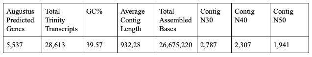

Renhao Luo's README.md

# I. Introduction

Yeast (Saccharomyces cerevisiae) has been recognized as an essential model in the field of biology because some essential cellular processes are the same in human and in yeast. Scientists could use the yeast as a model to investigate and disclose the connection between gene, protein, and functions.

In this project, we used publicly available Saccharomyces cerevisiae W303 PacBio data to assemble the yeast genome by using Canu. In the polishing stage, Quiver was applied to correct the structure, and Pilon was used to correcting nucleotides. Busco score was calculated to evaluate the assembly results, while basic statistical results were obtained by using Quast and used to compare our assembly results with the reference genome. Cumulative Distribution Function (CDF) was also used to determine the continuity of the assembled genome. Lastly, we run Augustus and TrinityStats to report the genome annotation and its basic statistical results, respectively.


# II. Pipeline

All of the codes used in this project are available in this Github repository. As long as the required environments and software have installed (details in section III), you should be able to run all the programs without changing the scripts. 


The entire Assembly workflow is shown in the graph above. The blue arrow represents where the result from each step would go. After each step, a Busco score is calculated, and statistical results are calculated by Quast. Lastly, graphs were constructed in the end, and Augustus and TrinityStats were run for gene annotation and basic statistical results. Each step is explained in the following sections. Information about versions and interpretations are described in the [final paper](https://docs.google.com/document/d/1BDGt6vxnI0uYwd2VWN8QQTd4IVIASFijE2-ZktaumLQ/edit?usp=sharing).

# III. Pipeline Steps

The naming of each parameter in each tool used are simple for your convenience. Please check our bash files in this repository for details on how we ran the program using those parameters. We designed the code try to be as clear as possible. 

## 1. Preparation

### 1.1 File Directory Set Up

The first step is to set up the file directory (File map attached in the end) on your machine. Our [create_folder.sh](Create_Environment/create_folder.sh) helps you to create directory for all the rawdata, scripts, and results.

### 1.2 Environment Set Up and Download Data

Follow the instruction to install miniconda [here](https://docs.conda.io/projects/conda/en/latest/user-guide/install/linux.html), and the instruction of cloning environments [here](https://docs.conda.io/projects/conda/en/latest/user-guide/tasks/manage-environments.html).

Three independent environments were used in this project, and the .yml files are linked below. 

All assembly works were completed in [final_project_1.yml](final_project_1.yml)
    
***Note: You need to have your own access to smrtanalysis v2.3.0p5 as it contains programs required by Pbalign and Quiver. The specific version of the tools are not available in Anaconda nor Bioconda.*** 

All the alignment graphs were generated in [final_project_2.yml](final_project_2.yml)

Augustus and TrinityStats were ran in [final_project_3.yml](final_project_3.yml)

All the data used in this project are publicly available. All the data can obtain by using ```wget```. All ```wget``` commands can be found in our [download_data.sh](Create_Environment/download_data.sh) bash file. There are total of 11 separated folders for the PacBio data, and 2 .FASTQ files for Illumina data. 

## 2. Canu Assembly

### 2.1 Converting raw data to a single master FASTQ

The Bash5tools is used to convert the PackBio raw data (.bas.h5) in each raw data folder to a FASTQ file.

The following code will be run in a for loop to covert all raw data in 11 folders to FASTQ file. (Check our [bash script](Canu/generate_fastq.sh) on how to use the tool)

```bash5tools.py --outFilePrefix ${output_file_name} --readType subreads --minLength 1000 --outType fastq --minReadScore 0.75 ${PacBio_raw_data}.bas.h5```

The output file is a FASTQ file for .bas.h5 file in each raw data folder. The name prefix is the same as the name prefix of the PacBio raw data file. As you can see from our file map (at the end of this README) that in each raw data file, there is a FASTQ file. The next step is to combine all the single FASTQ file to a master FASTQ file by using following code. 

```cat ${working_directory}/00*/*.fastq > ${working_directory}/yeast.fastq```

The output file name is ```yeast.fastq```. The yeast.fastq will be the input file for Canu. 

### 2.2 Canu run

Once we have the ```yeast.fastq```, we can run Canu to assemble the genome.

```canu -p 5_canu -d ${output_directory} genomeSize=12m -pacbio-raw yeast.fastq useGrid=false```

The variable "genomeSize" is given from the [Saccharomyces Genome Database](https://www.yeastgenome.org). There are many output files from Canu, and they all have 5_canu as their prefix. ```5_canu.contigs.fasta``` will be used for polishing. 

## 3. Polishing

### 3.1 Structural Polishing Using Long Reads (Quiver)

***Note: In this section, the first PacBio raw data folder (0001) is used as an example of running the example code. All the codes need to run for all 11 PacBio raw data folders to get final results. Details on how we run the codes are in scripts in this repository.***

***You need to have your access to smrtanalysis v2.3.0p5 for this section, and ```module load smrtanalysis/2.3.0p5``` before you run the codes in this section.***

### 3.1.1 Pbalign

Before run Pbalign, a .fofn file for each raw data needs to generate. To begin with, a master .fofn file is generated by using ```ls ${raw_data_directory}/*/*/*.bas.h5 > input_master.fofn```. 

Next, we generate one .fofn file for each raw data folder in the directory by using the code:

```echo ${raw_data_directory}/0001/*/*.bas.h5 >> input_0001.fofn ```

In the end, you will have 11 separated .fofn files (see file map in the end), and each of them contains the name of .bas.h5 files from the corresponding folders. Please refer to the executable [scripts](Polish/Quiver/prep_cmp_h5.sh) on how we completed the task in a ***for loop***. 

After having the required .fofn files, we can run Pbalignm, which maps PacBio reads to reference sequences. 

```pbalign --forQuiver input_0001.fofn 5_canu.contigs.fasta out_0001.cmp.h5```

The output of Pbalign is ```out_0001.cmp.h5```. Pbalign ran for every folder in the raw data directory, so 11 separated .cmp.h5 files will be generated. 

### 3.1.2 Quiver polishing

All of the .cmp.h5 files will need to merge into a master .cmp.h5 file by using Cmph5tools tool, and the code is as following:

``` cmph5tools.py merge --outFile out_all.cmp.h5 $(ls out_*.cmp.h5) ```

The output file is ```out_all.cmp.h5```. Next, sorting and filtering the ```out_all.cmp.h5``` before Quiver polishing use Cmph5tools and H5repack. Codes are as following.

```
cmph5tools.py sort --deep out_all.cmp.h5

h5repack -f GZIP=1 out_all.cmp.h5 tmp.cmp.h5 && mv tmp.cmp.h5 out_all.cmp.h5
```

The final output of all the steps are still ```out_all.cmp.h5```.
Furthermore, we need to index the ```5_canu.contigs.fasta``` before running Quiver using Samtools.

```samtools faidx 5_canu.contigs.fasta```

Lastly, we can run Quiver polishing:

```quiver out_all.cmp.h5 -r 5_canu.contigs.fasta -o variants.gff -o consensus.fasta -o consensus.fastq ```

The outputs of Quiver are three files, ```variants.gff``` ```consensus.fasta``` ```consensus.fastq```. 

***For the second round of Quvier, ```consensus.fasta``` will need to be index and use as reference.*** 

### 3.2 Nucleotide Polishing Using Short Reads (Pilon)

### 3.2.1 Align Illumina data

The Illumina raw data will need to align with long read before Pilon polishing. Bowtie2 is used to do this task. 

Before running Bowtie2, Botie2-build is needed for building a Bowtie index based on the Quiver polishing.

```bowtie2-build --threads ${NSLOTS} consensus.fasta consensus```

Bowtie2-build has 6 output files, including ``` .1.bt2, .2.bt2, .3.bt2, .4.bt2, .rev.1.bt2 ``` and ```.rev.2.bt2. ```, and they all will be used by Bowtie2. ```--threads ${NSLOTS}``` defines how many threads that the program allow to use.

Then, we can run Bowtie2 to align the illumina data. The Illumina data come with two separate FASTQ files. 

```bowtie2 --threads ${NSLOTS} -x consensus -1 ${1st_illumina_fastq_file} -2 ${2nd_illumina_fastq_file} -S W303_consensus.sam```

The output from Bowtie2 (aligned Illumina data) is the ```W303_consensus.sam```, which will be the input for Pilon. 

### 3.2.2 Pilon polishing

The ```W303_consensus.sam``` needs to be sorted and indexed before using as input for Pilon. These tasks need Samtools to complete. Codes are as following.

```
samtools view --threads ${NSLOTS} -b W303_consensus.sam --reference 5_canu.contigs.fasta` -o W303_consensus.bam

samtools sort --threads ${NSLOTS} W303_consensus.bam -o W303_consensus_sorted.bam

samtools index -b W303_consensus_sorted.bam W303_consensus_sorted.bai
```
The file that we need to use as input for Pilon is ```W303_consensus_sorted.bam```.

Then, we can run Pilon using the following code. 

```pilon --vcf --tracks --threads ${NSLOTS} --genome consensus.fasta --frags W303_consensus_sorted.bam --output consensus_pilon ```

The output file from Pilon is ```consensus_pilon.fasta```. Until here, the assembly process is completed. 

## 4. Analysis

### 4.1 Busco Score

We run the Busco after each step described above using following code.

Note: in order to run Busco, you need to download the Busco lineage dataset from their [offical website](https://busco.ezlab.org). we used ```saccharomycetales_odb9``` as the Busco lineage, and ```saccharomyces_cerevisiae_S288C``` as the species. The scripts for downloading the dataset are also available in our data download script.  

```run_busco -c ${NSLOTS} -i ${INPUT_FASTA} -l ../../rawdata/busco/saccharomycetales_odb9 -o 9_busco -m geno -sp saccharomyces_cerevisiae_S288C ```

In the code above, ```${INPUT_FASTA}``` is where you provide the FASTA file for evaluation. -l is the directory of the Busco lineage dataset. -m is the type of input, and -sp specifies the species. 

The output of Busco is a folder. In the example above, the folder is named as ```9_busco```. Inside the output folder, there will be a ```short_summary_9_busco.txt```, where your Busco score states inside. In the folder, there are different other files containing logs generated during the process. The results from Busco are showing in the table below with Quast results together. 

### 4.2 Quast

Quast is used to calculate the basic statistical results after each step. 

The code is as following.

```
quast ../7_pilon/consensus_pilon.fasta ../../rawdata/REF/HGAP_assembly.fasta ../../rawdata/REF/illumina_MPG_2013_contig.fasta -o quast_result
```
In this example, the final polished assembly result, HGAP assembly result, and the Illumina reference are used for comparison. It is possible to add more data for comparison. 

The output of Quast is a folder named ```quast_result``` in this particular example. There is a PDF document with all the data included inside the folder. 


The table above is a summary of the Busco and Quast results. Detail explanations are in our final paper. 

### 4.3 Alignment Plots

We used Mummerplot to generate alignment plots. Before using Mummerplot, we need to align the two input datasets by using Nucmer. Note: You should use contigs rather than scaffolded FASTA files for plotting. Use [separate_contig](Analysis/pyTools/separate_contigs.py) tool to convert scaffolded to contigs FASTA file.

Here, we use the result from the final polished assembly and Illumina reference data as an example. 

```
nucmer -p consensus_pilon_illumina \
illumina.fasta \
consensus_pilon.fasta
```
The ```illumina.fasta``` is the contig version of the illumina reference. The output file is ```consensus_pilon_illumina.delta``` in this case. The ```.delta``` file is used in Mummerplot to generate the plots using the following code. 

```
mummerplot --fat --layout --filter \
-p consensus_pilon_illumina consensus_pilon_illumina.delta \
-R illumina.fasta \
-Q consensus_pilon.fasta \
--png
```

The output of Mummerplot is ```consensus_pilon_illumina.png``` in this specific example. All the graphs generated are shown below. Detail descriptions and interpretations are in our final paper. 


### 4.4 Cumulative Distribution Function (CDF)

The CDF graph is generated by using python. The link to the python code is [here](Analysis/CDF/cdf_graph.py).

In the python code of generating CDF, the input files are set up as shown below with specific directories: 

```
file1 = "../7_pilon/consensus_pilon.fasta" # One Quiver and Pilon Polishing
file2 = "../../rawdata/REF/HGAP_assembly.fasta" # illumina contig reference
file3 = "../../rawdata/REF/illumina_MPG_2013_contig.fasta" # HGAP Assembly
```

It is possible to change the input files to other FASTA files in order to generate different the CDF graphs. 

The final CDF graph is shown below. Detail explanation can be found in our final paper. 


### 4.5 Augustus and TrinityNx

### 4.5.1 Augustus for gene annotation.

Augustus is used to getting the gene annotation, while the basic statistical results are from TrinityNx. 

We set the species to be ```saccharomyces_cerevisiae_S288C```. The following code was used to run Augustus:

```
augustus --species=saccharomyces_cerevisiae_S288C consensus_pilon.fasta --gff3=on --outfile=augustus_consensus_pilon.gff3  --stopCodonExcludedFromCDS=false
```
The output file from Augustus is ```augustus_consensus_pilon.gff3```, where the predicted gene information is stored. 

### 4.5.2 TrinityNx for statistical results.

Before running TrinityNx, we used Bedtool to convert .gff3 file to FASTA file using the following code.

```
bedtools getfasta -fi consensus_pilon.fasta -fo augustus_consensus_pilon.fasta -bed augustus_consensus_pilon.gff3
```
The output file is ```augustus_consensus_pilon.fasta```, and it is used for TrinityNx using the following code.

```
TrinityStats.pl  augustus_consensus_pilon.fasta > augustus_stat_report.txt
```
The output file is augustus_stat_report.txt, and the results are summarized in the table below. 



# IV. Conclusion

Results and discussion are in the Final Paper linked below.  

### [Final Write Up](https://docs.google.com/document/d/1BDGt6vxnI0uYwd2VWN8QQTd4IVIASFijE2-ZktaumLQ/edit?usp=sharing)


***A map of files are showing below.***

## File Map

```
|-- canu_job
|   |-- 10_mummer
|   |   |-- consensus_pilon_HGAP_assembly.delta
|   |   |-- consensus_pilon_HGAP_assembly.filter
|   |   |-- consensus_pilon_HGAP_assembly.fplot
|   |   |-- consensus_pilon_HGAP_assembly.gp
|   |   |-- consensus_pilon_HGAP_assembly.png
|   |   |-- consensus_pilon_HGAP_assembly.rplot
|   |   |-- consensus_pilon_illumina_MPG_2013.delta
|   |   |-- consensus_pilon_illumina_MPG_2013.filter
|   |   |-- consensus_pilon_illumina_MPG_2013.fplot
|   |   |-- consensus_pilon_illumina_MPG_2013.gp
|   |   |-- consensus_pilon_illumina_MPG_2013.png
|   |   |-- consensus_pilon_illumina_MPG_2013.rplot
|   |   `-- mummer_plot.sh
|   |-- 11_cdp
|   |   |-- cdf_graph.py
|   |   |-- CDF.png
|   |   `-- cdf.sh
|   |-- 12_augustus
|   |   |-- augustus_consensus_pilon.fasta
|   |   |-- augustus_consensus_pilon.gff3
|   |   |-- augustus.sh
|   |   |-- augustus_stat_report.txt
|   |   |-- bedtools.sh
|   |   |-- consensus_pilon.fasta -> ../7_pilon/consensus_pilon.fasta
|   |   |-- consensus_pilon.fasta.fai
|   |   `-- trinityNx.sh
|   |-- 2_unzip_pacbio
|   |   |-- 0001
|   |   |   |-- Analysis_Results
|   |   |   |   |-- m130605_000141_42207_c100515142550000001823076608221372_s1_p0.1.bax.h5
|   |   |   |   |-- m130605_000141_42207_c100515142550000001823076608221372_s1_p0.2.bax.h5
|   |   |   |   |-- m130605_000141_42207_c100515142550000001823076608221372_s1_p0.3.bax.h5
|   |   |   |   |-- m130605_000141_42207_c100515142550000001823076608221372_s1_p0.bas.h5
|   |   |   |   `-- m130605_000141_42207_c100515142550000001823076608221372_s1_p0.fastq
|   |   |   `-- m130605_000141_42207_c100515142550000001823076608221372_s1_p0.metadata.xml
|   |   |-- 0002
|   |   |   |-- Analysis_Results
|   |   |   |   |-- m130605_032054_42207_c100515142550000001823076608221373_s1_p0.1.bax.h5
|   |   |   |   |-- m130605_032054_42207_c100515142550000001823076608221373_s1_p0.2.bax.h5
|   |   |   |   |-- m130605_032054_42207_c100515142550000001823076608221373_s1_p0.3.bax.h5
|   |   |   |   |-- m130605_032054_42207_c100515142550000001823076608221373_s1_p0.bas.h5
|   |   |   |   `-- m130605_032054_42207_c100515142550000001823076608221373_s1_p0.fastq
|   |   |   `-- m130605_032054_42207_c100515142550000001823076608221373_s1_p0.metadata.xml
|   |   |-- 0007
|   |   |   |-- Analysis_Results
|   |   |   |   |-- m130605_231954_42210_c100515112550000001823076608221304_s1_p0.1.bax.h5
|   |   |   |   |-- m130605_231954_42210_c100515112550000001823076608221304_s1_p0.2.bax.h5
|   |   |   |   |-- m130605_231954_42210_c100515112550000001823076608221304_s1_p0.3.bax.h5
|   |   |   |   |-- m130605_231954_42210_c100515112550000001823076608221304_s1_p0.bas.h5
|   |   |   |   `-- m130605_231954_42210_c100515112550000001823076608221304_s1_p0.fastq
|   |   |   `-- m130605_231954_42210_c100515112550000001823076608221304_s1_p0.metadata.xml
|   |   |-- 0011
|   |   |   |-- Analysis_Results
|   |   |   |   |-- m130607_031915_42207_c100539492550000001823089611241310_s1_p0.1.bax.h5
|   |   |   |   |-- m130607_031915_42207_c100539492550000001823089611241310_s1_p0.2.bax.h5
|   |   |   |   |-- m130607_031915_42207_c100539492550000001823089611241310_s1_p0.3.bax.h5
|   |   |   |   |-- m130607_031915_42207_c100539492550000001823089611241310_s1_p0.bas.h5
|   |   |   |   `-- m130607_031915_42207_c100539492550000001823089611241310_s1_p0.fastq
|   |   |   `-- m130607_031915_42207_c100539492550000001823089611241310_s1_p0.metadata.xml
|   |   |-- 0012
|   |   |   |-- Analysis_Results
|   |   |   |   |-- m130607_063829_42207_c100539492550000001823089611241311_s1_p0.1.bax.h5
|   |   |   |   |-- m130607_063829_42207_c100539492550000001823089611241311_s1_p0.2.bax.h5
|   |   |   |   |-- m130607_063829_42207_c100539492550000001823089611241311_s1_p0.3.bax.h5
|   |   |   |   |-- m130607_063829_42207_c100539492550000001823089611241311_s1_p0.bas.h5
|   |   |   |   `-- m130607_063829_42207_c100539492550000001823089611241311_s1_p0.fastq
|   |   |   `-- m130607_063829_42207_c100539492550000001823089611241311_s1_p0.metadata.xml
|   |   |-- 0013
|   |   |   |-- Analysis_Results
|   |   |   |   |-- m130607_131654_42207_c100539492550000001823089611241313_s1_p0.1.bax.h5
|   |   |   |   |-- m130607_131654_42207_c100539492550000001823089611241313_s1_p0.2.bax.h5
|   |   |   |   |-- m130607_131654_42207_c100539492550000001823089611241313_s1_p0.3.bax.h5
|   |   |   |   |-- m130607_131654_42207_c100539492550000001823089611241313_s1_p0.bas.h5
|   |   |   |   `-- m130607_131654_42207_c100539492550000001823089611241313_s1_p0.fastq
|   |   |   `-- m130607_131654_42207_c100539492550000001823089611241313_s1_p0.metadata.xml
|   |   |-- 0014
|   |   |   |-- Analysis_Results
|   |   |   |   |-- m130607_095747_42207_c100539492550000001823089611241312_s1_p0.1.bax.h5
|   |   |   |   |-- m130607_095747_42207_c100539492550000001823089611241312_s1_p0.2.bax.h5
|   |   |   |   |-- m130607_095747_42207_c100539492550000001823089611241312_s1_p0.3.bax.h5
|   |   |   |   |-- m130607_095747_42207_c100539492550000001823089611241312_s1_p0.bas.h5
|   |   |   |   `-- m130607_095747_42207_c100539492550000001823089611241312_s1_p0.fastq
|   |   |   `-- m130607_095747_42207_c100539492550000001823089611241312_s1_p0.metadata.xml
|   |   |-- 0018
|   |   |   |-- Analysis_Results
|   |   |   |   |-- m130609_051143_42207_c100539282550000001823089611241380_s1_p0.1.bax.h5
|   |   |   |   |-- m130609_051143_42207_c100539282550000001823089611241380_s1_p0.2.bax.h5
|   |   |   |   |-- m130609_051143_42207_c100539282550000001823089611241380_s1_p0.3.bax.h5
|   |   |   |   |-- m130609_051143_42207_c100539282550000001823089611241380_s1_p0.bas.h5
|   |   |   |   `-- m130609_051143_42207_c100539282550000001823089611241380_s1_p0.fastq
|   |   |   `-- m130609_051143_42207_c100539282550000001823089611241380_s1_p0.metadata.xml
|   |   |-- 0019
|   |   |   |-- Analysis_Results
|   |   |   |   |-- m130609_050958_42210_c100539382550000001823089611241350_s1_p0.1.bax.h5
|   |   |   |   |-- m130609_050958_42210_c100539382550000001823089611241350_s1_p0.2.bax.h5
|   |   |   |   |-- m130609_050958_42210_c100539382550000001823089611241350_s1_p0.3.bax.h5
|   |   |   |   |-- m130609_050958_42210_c100539382550000001823089611241350_s1_p0.bas.h5
|   |   |   |   `-- m130609_050958_42210_c100539382550000001823089611241350_s1_p0.fastq
|   |   |   `-- m130609_050958_42210_c100539382550000001823089611241350_s1_p0.metadata.xml
|   |   |-- 0020
|   |   |   |-- Analysis_Results
|   |   |   |   |-- m130609_083056_42207_c100539282550000001823089611241381_s1_p0.1.bax.h5
|   |   |   |   |-- m130609_083056_42207_c100539282550000001823089611241381_s1_p0.2.bax.h5
|   |   |   |   |-- m130609_083056_42207_c100539282550000001823089611241381_s1_p0.3.bax.h5
|   |   |   |   |-- m130609_083056_42207_c100539282550000001823089611241381_s1_p0.bas.h5
|   |   |   |   `-- m130609_083056_42207_c100539282550000001823089611241381_s1_p0.fastq
|   |   |   `-- m130609_083056_42207_c100539282550000001823089611241381_s1_p0.metadata.xml
|   |   `-- 0021
|   |       |-- Analysis_Results
|   |       |   |-- m130609_082855_42210_c100539382550000001823089611241351_s1_p0.1.bax.h5
|   |       |   |-- m130609_082855_42210_c100539382550000001823089611241351_s1_p0.2.bax.h5
|   |       |   |-- m130609_082855_42210_c100539382550000001823089611241351_s1_p0.3.bax.h5
|   |       |   |-- m130609_082855_42210_c100539382550000001823089611241351_s1_p0.bas.h5
|   |       |   `-- m130609_082855_42210_c100539382550000001823089611241351_s1_p0.fastq
|   |       `-- m130609_082855_42210_c100539382550000001823089611241351_s1_p0.metadata.xml
|   |-- 4_merged_fastq
|   |   `-- yeast.fastq
|   |-- 5_canu
|   |   |-- 5_canu.contigs.fasta
|   |   |-- 5_canu.contigs.gfa
|   |   |-- 5_canu.contigs.layout
|   |   |-- 5_canu.contigs.layout.readToTig
|   |   |-- 5_canu.contigs.layout.tigInfo
|   |   |-- 5_canu.correctedReads.fasta.gz
|   |   |-- 5_canu.report
|   |   |-- 5_canu.seqStore.err
|   |   |-- 5_canu.seqStore.ssi
|   |   |-- 5_canu.trimmedReads.fasta.gz
|   |   |-- 5_canu.unassembled.fasta
|   |   |-- 5_canu.unitigs.bed
|   |   |-- 5_canu.unitigs.fasta
|   |   |-- 5_canu.unitigs.gfa
|   |   |-- 5_canu.unitigs.layout
|   |   |-- 5_canu.unitigs.layout.readToTig
|   |   |-- 5_canu.unitigs.layout.tigInfo
|   |   |-- canu-logs
|   |   |-- canu-scripts
|   |   |-- haplotype
|   |   `-- tree
|   |-- 6_quiver
|   |   |-- 2_unzip_pacbio -> ../2_unzip_pacbio
|   |   |-- 5_canu.contigs.fasta -> ../5_canu/5_canu.contigs.fasta
|   |   |-- 5_canu.contigs.fasta.fai
|   |   |-- consensus.fasta
|   |   |-- consensus.fastq
|   |   |-- input_0001.fofn
|   |   |-- input_0002.fofn
|   |   |-- input_0007.fofn
|   |   |-- input_0011.fofn
|   |   |-- input_0012.fofn
|   |   |-- input_0013.fofn
|   |   |-- input_0014.fofn
|   |   |-- input_0018.fofn
|   |   |-- input_0019.fofn
|   |   |-- input_0020.fofn
|   |   |-- input_0021.fofn
|   |   |-- input_master.fofn
|   |   |-- merge_cmp_h5.sh
|   |   |-- myjoblist.txt
|   |   |-- out_0001.cmp.h5
|   |   |-- out_0002.cmp.h5
|   |   |-- out_0007.cmp.h5
|   |   |-- out_0011.cmp.h5
|   |   |-- out_0012.cmp.h5
|   |   |-- out_0013.cmp.h5
|   |   |-- out_0014.cmp.h5
|   |   |-- out_0018.cmp.h5
|   |   |-- out_0019.cmp.h5
|   |   |-- out_0020.cmp.h5
|   |   |-- out_0021.cmp.h5
|   |   |-- out_all.cmp.h5
|   |   |-- pbalign.sh
|   |   |-- prep_cmp_h5.sh
|   |   |-- quiver_run.sh
|   |   `-- variants.gff
|   |-- 7_pilon
|   |   |-- bowtie2.sh
|   |   |-- bowtie_build.sh
|   |   |-- consensus.1.bt2
|   |   |-- consensus.2.bt2
|   |   |-- consensus.3.bt2
|   |   |-- consensus.4.bt2
|   |   |-- consensus.fasta -> ../6_quiver/consensus.fasta
|   |   |-- consensus.fasta.fai
|   |   |-- consensus_pilonBadCoverage.wig
|   |   |-- consensus_pilonChanges.wig
|   |   |-- consensus_pilonClippedAlignments.wig
|   |   |-- consensus_pilonCopyNumber.wig
|   |   |-- consensus_pilonCoverage.wig
|   |   |-- consensus_pilonDeltaCoverage.wig
|   |   |-- consensus_pilonDipCoverage.wig
|   |   |-- consensus_pilon.fasta
|   |   |-- consensus_pilonGC.wig
|   |   |-- consensus_pilonPctBad.wig
|   |   |-- consensus_pilonPhysicalCoverage.wig
|   |   |-- consensus_pilonPilon.bed
|   |   |-- consensus_pilonUnconfirmed.wig
|   |   |-- consensus_pilon.vcf
|   |   |-- consensus_pilonWeightedMq.wig
|   |   |-- consensus_pilonWeightedQual.wig
|   |   |-- consensus.rev.1.bt2
|   |   |-- consensus.rev.2.bt2
|   |   |-- pilon_run.sh
|   |   |-- samtools.sh
|   |   |-- SRR1569900_1.fastq -> ../../rawdata/illumina/SRR1569900_1.fastq
|   |   |-- SRR1569900_2.fastq -> ../../rawdata/illumina/SRR1569900_2.fastq
|   |   |-- W303_consensus.bam
|   |   |-- W303_consensus.sam
|   |   |-- W303_consensus_sorted.bai
|   |   `-- W303_consensus_sorted.bam
|   |-- 8_quast
|   |   |-- quast_result
|   |   |   |-- basic_stats
|   |   |   |   |-- consensus_pilon_GC_content_plot.pdf
|   |   |   |   |-- cumulative_plot.pdf
|   |   |   |   |-- GC_content_plot.pdf
|   |   |   |   |-- HGAP_assembly_GC_content_plot.pdf
|   |   |   |   |-- illumina_MPG_2013_contig_GC_content_plot.pdf
|   |   |   |   `-- Nx_plot.pdf
|   |   |   |-- icarus.html
|   |   |   |-- icarus_viewers
|   |   |   |   `-- contig_size_viewer.html
|   |   |   |-- quast.log
|   |   |   |-- report.html
|   |   |   |-- report.pdf
|   |   |   |-- report.tex
|   |   |   |-- report.tsv
|   |   |   |-- report.txt
|   |   |   |-- transposed_report.tex
|   |   |   |-- transposed_report.tsv
|   |   |   `-- transposed_report.txt
|   |   `-- quast.sh
|   `-- 9_busco
|       |-- busco.sh
|       |-- run_9_busco_Final_Assembly
|       |   |-- angustus_output
|       |   |-- blask_output
|       |   |-- full_table_9_busco_Final_Assembly.tsv
|       |   |-- hmmer_output
|       |   |-- missing_busco_list_9_busco_Final_Assembly.tsv
|       |   |-- short_summary_9_busco_Final_Assembly.txt
|       |   `-- single_copy_busco_sequences
|       `-- tmp
|-- canu_run.sh
|-- create_folder.sh
|-- directory_tree.txt
|-- download_data.sh
|-- generate_fastq.sh
`-- rawdata
    |-- busco
    |   |-- saccharomycetales_odb9
    |   |   |-- ancestral
    |   |   |-- ancestral_variants
    |   |   |-- dataset.cfg
    |   |   |-- hmms
    |   |   |-- info
    |   |   |-- lengths_cutoff
    |   |   |-- prfl
    |   |   `-- scores_cutoff
    |   `-- saccharomycetales_odb9.tar.gz
    |-- illumina
    |   |-- SRR1569900_1.fastq
    |   `-- SRR1569900_2.fastq
    `-- REF
        |-- HGAP_assembly.fasta
        |-- illumina_MPG_2013_contig.fasta
        |-- illumina_MPG_2013.fasta
        |-- separate_short_read_contigs.py
        `-- separate_short_read_contigs.sh

54 directories, 217 files
```
